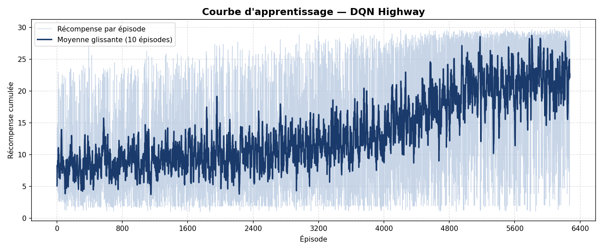
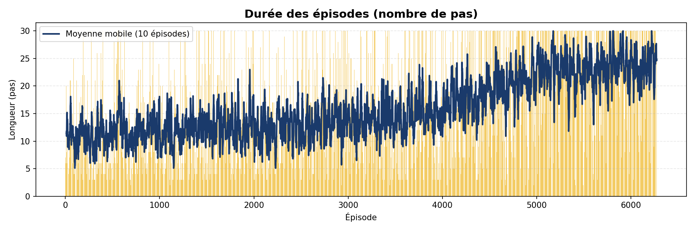
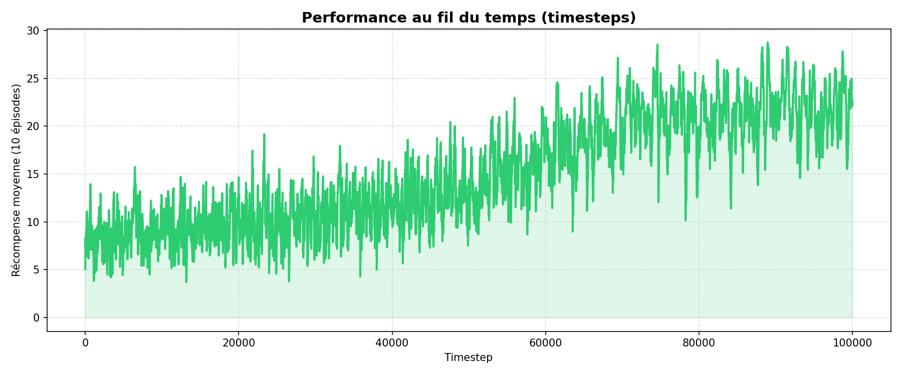

<p align="center">
	
</p>

<p align="center">
	
	
	
	
	
</p>

## Apercu

Ce projet entraine un agent de conduite autonome avec **DQN** dans `highway-fast-v0`.

Mission:

- survivre plus longtemps,
- eviter les collisions,
- ameliorer la recompense moyenne episode apres episode.

Le flux de travail est deja complet:

- entrainement,
- logging CSV,
- evaluation visuelle,
- visualisation des performances.

---

## Pit Stop Rapide

```bash
python -m venv .venv
source .venv/Scripts/activate   # Git Bash
python -m pip install -r requirements.txt
python -m src.train_dqn
python -m src.evaluate
python -m src.plot_results
```

---

## Stack

- `gymnasium`
- `highway-env`
- `stable-baselines3[extra]`
- `shimmy`
- `matplotlib`
- `pandas`

---

## Arborescence

```text
voiture_autonome/
|- data/
|- logs/
|- models/
|- notebooks/
|- results/
|- src/
|  |- config.py         # Hyperparametres et chemins
|  |- train_dqn.py      # Entrainement + callback CSV
|  |- evaluate.py       # Evaluation visuelle (render human)
|  |- plot_results.py   # Courbes et resume statistique
|  |- env_wrapper.py    # Config personnalisee de l'environnement
|- requirements.txt
|- README.md
```

---

## Installation detaillee

### 1. Cloner

```bash
git clone <URL_DU_REPO>
cd voiture_autonome
```

### 2. Environnement virtuel

Windows PowerShell:

```powershell
python -m venv .venv
.\.venv\Scripts\Activate.ps1
```

Git Bash:

```bash
python -m venv .venv
source .venv/Scripts/activate
```

### 3. Dependances

```bash
python -m pip install -r requirements.txt
```

---

## Commandes de course

### Lancer l'entrainement

```bash
python -m src.train_dqn
```

Sorties:

- modele: `models/dqn_highway_experts_100k`
- logs: `results/training_log.csv`

### Lancer l'evaluation visuelle

```bash
python -m src.evaluate
```

### Generer les graphes

```bash
python -m src.plot_results
```

Graphiques produits dans `results/`:

- `reward_plot.png`
- `episode_length_plot.png`
- `timestep_reward_plot.png`

---

## Reglages DQN actuels

Depuis `src/config.py`:

- `ENV_NAME=highway-fast-v0`
- `net_arch=[256, 256]`
- `LEARNING_RATE=5e-4`
- `BUFFER_SIZE=15000`
- `GAMMA=0.8`
- `EXPLORATION_FRACTION=0.7`
- `TOTAL_TIMESTEPS=100000`

---

## Resultats

Tu peux embed les images dans GitHub:

```md



```

---

## Notebooks

Le dossier `notebooks/` contient:

- `notebooks/01_test_environnement.ipynb`
- `notebooks/02_exploration_donnees.ipynb`

---

## Conseils

- Utiliser l'interpreteur `./.venv/Scripts/python.exe` dans VS Code.
- Si un import reste en erreur: reload de la fenetre VS Code.
- Relancer `python -m src.plot_results` apres chaque session d'entrainement.

---

## Roadmap

- [ ] sauvegarde automatique du meilleur checkpoint
- [ ] comparaison DQN vs PPO
- [ ] variation des fonctions de recompense
- [ ] export video des episodes

---

<p align="center">
	
	
</p>
